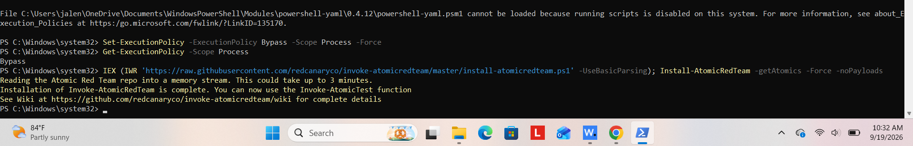
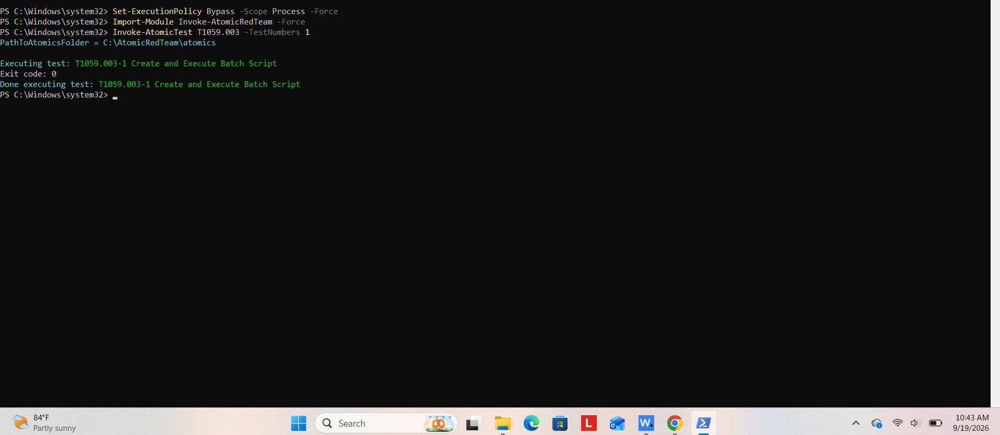
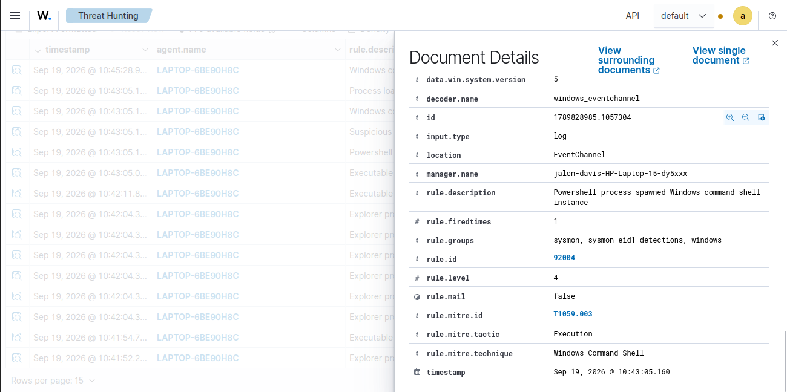
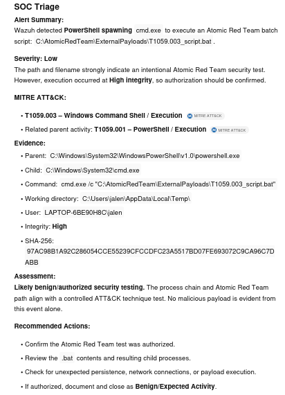

# 🛡️ Wazuh AI-Assisted SOC Alert Triage Lab

## Overview

This project demonstrates an end-to-end Security Operations Center (SOC) workflow using **Wazuh, Atomic Red Team, MITRE ATT&CK, PowerShell, and AI-assisted alert triage**.

The goal of this lab was to generate controlled adversary activity on a monitored Windows endpoint, detect that activity using Wazuh, use AI to assist with the initial investigation, and then manually verify the AI's conclusions.

A major focus of this project was understanding how AI can assist SOC analysts while also identifying why **human validation is still necessary before making a final decision on a security alert**.

---

## 🔬 Lab Workflow

```text
Atomic Red Team
      │
      ▼
Windows Endpoint
      │
      │ Wazuh Agent
      ▼
Wazuh Manager / SIEM
      │
      ▼
Security Alert
      │
      ▼
AI-Assisted Triage
      │
      ▼
Human Verify & Correct
```

---

## 🛠️ Technologies Used

- Wazuh SIEM
- Windows
- Wazuh Agent
- Atomic Red Team
- PowerShell
- MITRE ATT&CK
- AI-assisted SOC analysis

---

## 🎯 Lab Objectives

The objectives of this project were to:

- Generate controlled adversary activity on a Windows endpoint
- Monitor endpoint activity using Wazuh
- Test Wazuh's ability to detect MITRE ATT&CK techniques
- Investigate security alerts using Wazuh Threat Hunting
- Use AI to perform initial SOC alert triage
- Compare the AI's conclusions against the actual activity
- Identify limitations of AI-assisted security analysis
- Demonstrate the importance of human validation

---

## 1. Atomic Red Team Setup

Atomic Red Team was installed and configured on the monitored Windows endpoint.

During installation, PowerShell's execution policy initially prevented one of the required modules from running. I used a process-scoped execution policy bypass to allow the module to execute and successfully completed the Atomic Red Team installation.

The execution policy change was limited to the active PowerShell process.



---

## 2. Simulating MITRE ATT&CK T1059.003

For the attack simulation, I executed:

**MITRE ATT&CK T1059.003 — Windows Command Shell**

Specifically, I used Atomic Red Team:

**T1059.003-1 — Create and Execute Batch Script**

The test was executed through PowerShell using:

```powershell
Invoke-AtomicTest T1059.003 -TestNumbers 1
```

Atomic Red Team created and executed the test batch script using the Windows Command Shell.

The test completed successfully with:

```text
Exit code: 0
```

This confirmed that the simulated activity successfully executed on the Windows endpoint.



---

## 3. Detecting the Activity with Wazuh

After executing the Atomic Red Team test, I investigated the endpoint telemetry using **Wazuh Threat Hunting**.

Wazuh successfully generated an alert corresponding with the activity.

### Detection Details

| Field | Value |
|---|---|
| Rule ID | `92004` |
| Rule Level | `4` |
| Description | PowerShell process spawned Windows command shell instance |
| MITRE ATT&CK ID | `T1059.003` |
| MITRE Tactic | Execution |
| MITRE Technique | Windows Command Shell |

The detection showed that Wazuh recognized PowerShell spawning a Windows command shell, which corresponded with the Atomic Red Team activity I intentionally generated.


---

## 4. AI-Assisted Alert Triage

After identifying the alert, I provided the Wazuh alert data to an AI system and asked it to act as a SOC analyst.

The AI was asked to determine:

- Alert summary
- Severity
- MITRE ATT&CK mapping
- Supporting evidence
- Whether the activity appeared benign, suspicious, or malicious
- Recommended investigation actions

The AI identified that **PowerShell spawned `cmd.exe`**, which then executed an Atomic Red Team batch script.

The process chain identified during the analysis was:

```text
powershell.exe
      │
      ▼
cmd.exe
      │
      ▼
Atomic Red Team Batch Script
```

The AI mapped the activity to:

**T1059.003 — Windows Command Shell**

It also identified related PowerShell execution activity and rated the alert as **Low severity**.

Its overall assessment was that the activity was:

> **Likely benign/authorized security testing.**

The AI recommended confirming that the Atomic Red Team test was authorized, reviewing the batch file and resulting child processes, checking for unexpected persistence or network activity, and documenting the event as expected activity if authorization was confirmed.



---

## 5. Verify & Correct

The final stage of the lab was to independently verify the AI's analysis rather than automatically accepting its conclusions.

I compared the AI's findings against both the Wazuh telemetry and the activity I intentionally performed using Atomic Red Team.

### What Activity Did the AI Identify?

The AI concluded that the Wazuh alert was triggered by PowerShell spawning `cmd.exe`, which then executed the Atomic Red Team batch script.

This matched the activity generated during the lab.

### What Actually Caused the Alert?

I installed and configured Atomic Red Team on my Windows endpoint and ran the T1059.003 test through PowerShell.

The specific test was:

**T1059.003-1 — Create and Execute Batch Script**

### What Did the AI Get Correct?

The AI correctly identified the severity as low, correctly identified the MITRE ATT&CK ID, and correctly determined that I was most likely running an authorized security test.

It also correctly identified the relationship between PowerShell, `cmd.exe`, and the Atomic Red Team batch script.

### Was Anything Incorrect?

From my point of view, the AI did not get anything technically wrong.

The analysis matched what I actually did in the lab.

However, the AI could not know for certain that the Atomic Red Team test was authorized.

That required additional context that I had as the human analyst.

### Verifying the MITRE ATT&CK Mapping

The AI correctly identified the ATT&CK technique and gave the correct reasoning behind the ID.

It correctly stated that:

**T1059.003 represents Windows Command Shell execution.**

This matched both the Wazuh detection and the Atomic Red Team technique I intentionally executed.

### Verifying the Severity

I agreed with the AI rating the severity as low because the activity was generated from an authorized security test that I intentionally ran using Atomic Red Team.

However, there is an important distinction between my assessment and the AI's assessment.

I **knew** that the activity was authorized.

The AI could only **infer** that it was likely authorized based on the information available in the security alert.

### Evaluating the Recommended Actions

The AI's recommended actions were appropriate because the first step should be confirming whether the Atomic Red Team test was actually authorized.

If authorization is confirmed, the alert can then be documented as benign or expected activity.

The AI also recommended additional investigation, including:

- Reviewing the `.bat` file
- Reviewing resulting child processes
- Checking for unexpected persistence
- Checking for unexpected network connections
- Checking for additional payload execution

These actions provide additional evidence before an analyst makes a final decision about the alert.

---

## 🧠 Human Analyst vs. AI Context

One of the most important findings from this lab was the difference between what **I knew as the human analyst** and what the **AI could determine from telemetry**.

I knew that the test was authorized because I personally executed it.

Therefore, I knew that the actual severity of this specific event was low.

The AI could not know for certain whether the activity was authorized. It inferred that the severity was low based on evidence such as the Atomic Red Team file path and process activity.

This is an important limitation when using AI for cybersecurity analysis.

---

## 🔍 Why Human Verification Matters

Human verification is important when analyzing security alerts because an attacker could potentially attempt to disguise malicious activity to make it look like an Atomic Red Team test or another authorized security tool.

If an AI system automatically assumes that anything associated with Atomic Red Team is authorized, malicious activity could potentially be incorrectly classified as benign.

For example:

```text
AI observes Atomic Red Team indicators
             │
             ▼
AI assumes security testing
             │
             ▼
Alert classified as low severity
             │
             ▼
Potential malicious activity overlooked
```

A human analyst can provide additional context and verify whether:

- The security test was actually authorized
- The user was permitted to perform the test
- The command matches the expected test
- Unexpected processes were created
- Persistence mechanisms were established
- Unexpected network connections occurred
- Additional payloads were executed

This demonstrates why AI-generated conclusions should still be validated by a human analyst.

---

## 💡 Key Finding

The most important lesson from this project was that **technical detection and organizational context are not the same thing**.

Wazuh successfully detected the behavior.

AI successfully interpreted much of the telemetry.

However, the human analyst possessed information that neither system could independently determine:

> **Was this activity actually authorized?**

AI can help analysts quickly interpret alerts, identify MITRE ATT&CK techniques, understand process relationships, and recommend investigation steps.

However, AI should assist the analyst rather than automatically make the final decision.

---

## 📚 Skills Demonstrated

This project demonstrates hands-on experience with:

- Security Information and Event Management (SIEM)
- Wazuh
- Windows endpoint monitoring
- Threat hunting
- Security alert investigation
- Atomic Red Team
- Adversary simulation
- MITRE ATT&CK
- PowerShell
- Windows process analysis
- SOC alert triage
- Security event validation
- AI-assisted cybersecurity analysis
- Human-in-the-loop security analysis

---

## 📁 Repository Structure

```text
Wazuh-AI-SOC-Lab/
│
├── README.md
│
└── screenshots/
    ├── 01-atomic-red-team-setup.png
    ├── 02-atomic-test-execution.png
    ├── 03-wazuh-detection.png
    └── 04-ai-triage.png
```

---

## 📌 Final Conclusion

The Wazuh alert was correct, and the AI's analysis was also correct.

I used **Atomic Red Team** to generate controlled **T1059.003 Windows Command Shell** activity on a monitored Windows endpoint. Wazuh successfully detected the behavior and mapped it to the appropriate MITRE ATT&CK technique.

AI was then used to assist with the initial SOC triage. It correctly identified the attack technique, process activity, security-testing context, and recommended investigation steps.

However, the AI classified the activity as low severity without having enough context to know for certain that the test was authorized.

While AI analysis can be a very useful tool in cybersecurity, it should not be solely trusted or implemented in an environment without **human validation**.

This lab demonstrated how AI can improve the speed and efficiency of SOC alert triage while reinforcing the importance of keeping a human analyst involved in the final investigation and decision-making process.
